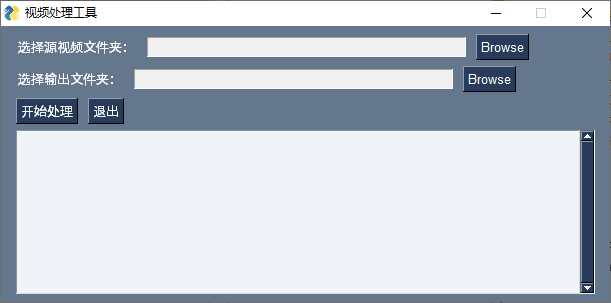

# jdvideo_renew
京东视频伪原创工具-简版

# 视频批量伪原创处理工具  

一款专为视频搬运场景设计的批量处理工具，通过视频尺寸调整、文字叠加和AI标题生成等功能，有效提高视频原创度，提升平台审核通过率。经测试，使用本工具处理的视频京东过审率超过80%。  

## 🌟 核心功能  
- **视频差异化处理**：自动调整视频尺寸并添加自定义文字叠加，改变视频特征  
- **AI智能标题生成**：基于阿里云Qwen模型生成营销向短标题，提升内容吸引力  
- **批量自动化处理**：支持一次性处理大量视频文件，大幅提高工作效率  
- **多线程并行处理**：利用多线程技术加速处理过程，充分利用硬件资源  
- **可视化操作界面**：简洁易用的图形界面，无需命令行操作基础  

## 📦 安装方法  

### 直接生成可执行文件（推荐）  
1. 下载配置好.py源文件   
2. pyinstaller命令生成`视频批量伪原创处理工具.exe`  

### 依赖环境  
- Python 3.8+  
- MoviePy (视频处理)  
- PySimpleGUI (图形界面)  
- openai (AI标题生成)  
- ImageMagick (视频处理依赖)  

## 🚀 使用说明  
1. **打开软件**：运行程序后，界面如下（可添加截图）：  
     

2. **配置参数**：  
   - 选择**素材文件夹**：存放原始视频的目录（支持MP4格式）  
   - 选择**输出文件夹**：处理后视频的保存位置  
   - 选择**JSON文件**：包含视频相关信息的JSON文件（可选）  
   - 设置**线程数**：建议根据CPU核心数设置（1-10）  

3. **开始处理**：点击"开始处理"按钮，程序将自动：  
   - 读取所有MP4视频文件  
   - 为每个视频生成AI标题  
   - 添加文字叠加并调整视频尺寸  
   - 保存处理后的视频到输出文件夹  

4. **查看日志**：处理过程和结果显示在日志区域，便于跟踪进度和排查问题  

## 📊 处理示例  
### 标题生成效果  
- 原始标题："2025新款夏季连衣裙 显瘦百搭 限时折扣"  
- 生成标题："夏季显瘦连衣裙爆款"  
- 生成标题："百搭连衣裙时尚必备"  
- 生成标题："新款连衣裙显瘦神器"  

## ⚙️ 技术原理  
### 视频差异化处理  
- 采用MoviePy库对视频进行1.1倍放大后居中裁剪，改变视频分辨率特征  
- 在视频上方添加随机配色的文字叠加，文字内容为AI生成的营销标题  

### AI标题生成  
- 对接阿里云Qwen大模型API，基于营销广告场景进行标题优化  
- 自动过滤原标题中的价格和促销信息，生成4-10字的短标题  
- 每次生成角度不同，确保标题多样性  

### 多线程处理  
- 使用Python threading模块实现多线程并行处理  
- 每个线程独立处理视频文件，提高整体处理效率  

## 📝 注意事项  
### ImageMagick配置  
- 程序默认使用：`D:/Program Files/ImageMagick-7.1.1-Q16-HDRI/magick.exe`  
- 如路径不同，请修改代码中的`change_settings`函数参数  

### API密钥设置  
- AI标题生成功能使用阿里云API，需在代码中配置有效的API密钥  
- 目前测试密钥可能已过期，请自行申请并替换  

### 视频格式支持  
- 目前仅支持MP4格式视频文件  
- 如需支持其他格式，可修改`process_videos`函数中的文件筛选条件  

### 过审率说明  
- 80%过审率基于特定平台和内容类型测试  
- 实际过审率可能因平台规则变化和内容类型不同而有所差异  

## 📧 联系方式  
如有问题或定制需求，可通过以下方式联系：  
- VX:liumingdada

